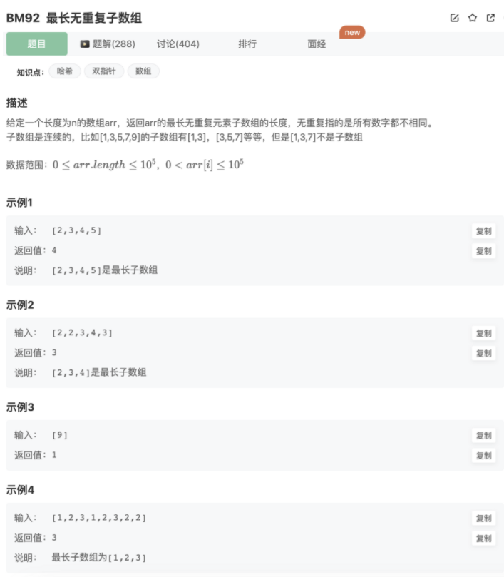

# 最长无重复子数组

## 题目



## 思路

1.暴力解法

2.利用哈希+双指针滑动窗口找所有子串的方式

具体步骤：

1.右指针遍历数组，hash统计字符出现次数

2.当出现次数大于1，则窗口左移收缩（收缩时为了能够继续前进去遍历），同时需要减少hash中该字符出现的次数

3.拿出右移和右移加收缩后的的数组长度，和max比较，得出最大值

## 代码

利用哈希+双指针滑动窗口找所有子串的方式

```jsx
/**
 * @param arr int整型一维数组 the array
 * @return int整型
 */
function maxLength( arr ) {
    // map
    let map = new Map()
    // 双指针
    let cnt = 1
    // 设置窗口左右边界
    for(let left=0,right=0;right<arr.length;right++){
        // 窗口右移进入哈希表统计出现次数
        if(map.get(arr[right])){
            map.set(arr[right],map.get(arr[right])+1)
        }else{
            map.set(arr[right],1)
        }
        // 出现次数大于1，则窗口内有重复
        while(map.get(arr[right]) > 1){
            // 窗口左移，同时减去该数字的出现次数
            map.set(arr[left],map.get(arr[left++])-1)
        }
        // 维护子数组长度最大值
        cnt = Math.max(cnt,right-left+1)
    }
    return cnt
}
module.exports = {
    maxLength : maxLength
};
```

暴力解法（超时）

```jsx
/**
 * @param arr int整型一维数组 the array
 * @return int整型
 */
function maxLength( arr ) {
    // 双指针
    let cnt = 1
    for(let i=0;i<arr.length;i++){
        for(let j=i+1;j<arr.length;j++){
            if(arr.slice(i,j).includes(arr[j])){
                break
            }else{
                if(cnt < j-i+1){
                    cnt = j-i+1
                }
            }
        }
    }
    return cnt
}
module.exports = {
    maxLength : maxLength
};
```