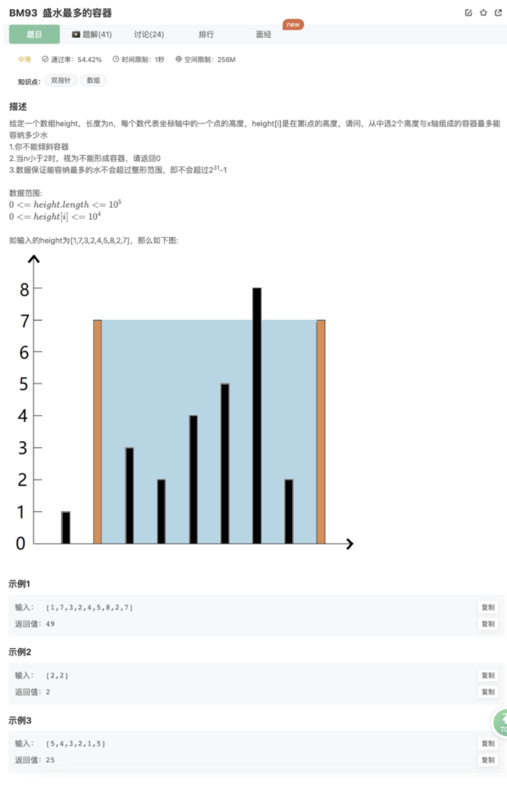
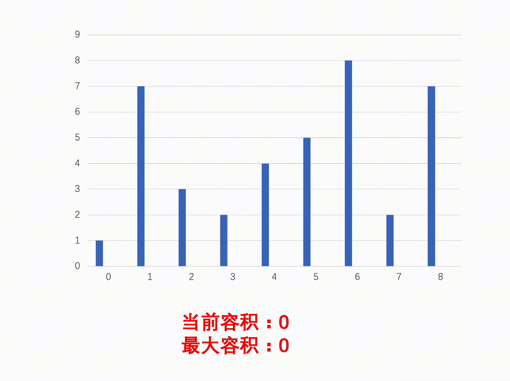

# 盛水最多的容器

## 题目



## 思路

### **方法：贪心法**

**知识点1：双指针**

双指针指的是在遍历对象的过程中，不是普通的使用单个指针进行访问，而是使用两个指针（特殊情况甚至可以多个），两个指针或是同方向访问两个链表、或是同方向访问一个链表（快慢指针）、或是相反方向扫描（对撞指针），从而达到我们需要的目的。

**知识点2：贪心思想**

贪心思想属于动态规划思想中的一种，其基本原理是找出整体当中给的每个局部子结构的最优解，并且最终将所有的这些局部最优解结合起来形成整体上的一个最优解。

**思路：**

这道题利用了水桶的短板原理，**较短的一边控制最大水量**，因此直接用较短边长乘底部两边距离就可以得到当前情况下的容积。但是要怎么找最大值呢？

可以利用贪心思想：我们都知道容积与最短边长和底边长有关，与长的底边一定以首尾为边，但是首尾不一定够高，中间可能会出现更高但是底边更短的情况，因此我们可以使用对撞双指针向中间靠，这样底边长会缩短，因此还想要有更大容积只能是增加最短变长，此时我们每次指针移动就移动较短的一边，因为贪心思想下较长的一边比较短的一边更可能出现更大容积

具体步骤：

- step 1：优先排除不能形成容器的特殊情况。
- step 2：初始化双指针指向数组首尾，每次利用上述公式计算当前的容积，维护一个最大容积作为返回值。
- step 3：对撞双指针向中间靠，但是依据贪心思想，每次指向较短边的指针向中间靠，另一指针不变。



## 代码

```jsx
/**
 * 代码中的类名、方法名、参数名已经指定，请勿修改，直接返回方法规定的值即可
 * @param height int整型一维数组 
 * @return int整型
 */
function maxArea( height ) {
    let left = 0,right = height.length-1
    let max = 0
    while(left<right){
        let cur = (right-left)*Math.min(height[left],height[right])
        console.log(cur)
        if(cur > max){
            max = cur
        }
        if(height[left]<=height[right]){
            left++
        }else{
            right--
        }
    }
    return max
}
module.exports = {
    maxArea : maxArea
};
```