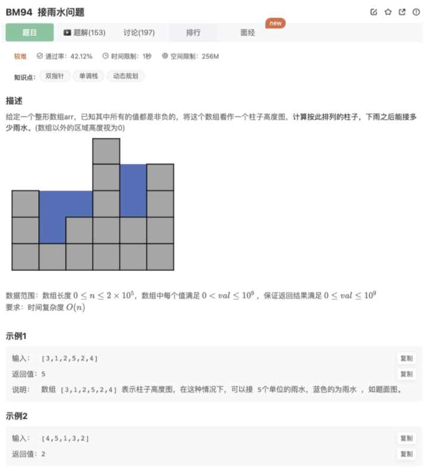

# 接雨水问题

## 题目



## 思路

### **方法：双指针(推荐使用)**

**知识点：双指针**

双指针指的是在遍历对象的过程中，不是普通的使用单个指针进行访问，而是使用两个指针（特殊情况甚至可以多个），两个指针或是同方向访问两个链表、或是同方向访问一个链表（快慢指针）、或是相反方向扫描（对撞指针），从而达到我们需要的目的。

**思路：**

我们都知道水桶的短板问题，控制水桶水量的是最短的一条板子。这道题也是类似，我们可以将整个图看成一个水桶，两边就是水桶的板，中间比较低的部分就是水桶的底，由较短的边控制水桶的最高水量。但是水桶中可能出现更高的边，比如上图第四列，它比水桶边还要高，那这种情况下它是不是将一个水桶分割成了两个水桶，而中间的那条边就是两个水桶的边。

有了这个思想，解决这道题就容易了，因为我们这里的水桶有两个边，因此可以考虑使用对撞双指针往中间靠。

**具体做法：**

- step 1：检查数组是否为空的特殊情况
- step 2：准备双指针，分别指向数组首尾元素，代表最初的两个边界
- step 3：指针往中间遍历，遇到更低柱子就是底，用较短的边界减去底就是这一列的接水量，遇到更高的柱子就是新的边界，更新边界大小


## 代码

```jsx
/**
 * max water
 * @param arr int整型一维数组 the array
 * @return long长整型
 */
function maxWater( arr ) {
    // 排除空数组
    if(arr.length === 0){
        return 0
    }
    let res = 0
    // 左右指针
    let left = 0,right = arr.length - 1
    // 中间区域的边界高度
    let maxL = 0
    let maxR = 0
    // 直到左右指针相遇
    while(left<right){
        // 每次维护往中间的最大边界，不管左右指针走到哪里，决定盛水的关键是最高的那个
        maxL = Math.max(maxL,arr[left])
        maxR = Math.max(maxR,arr[right])
        // 较短的边界确定该个字的水量
        if(maxR > maxL){
            res += maxL - arr[left++]
        }else{
            res += maxR - arr[right--]
        }
    }
    return res
}
module.exports = {
    maxWater : maxWater
};
```