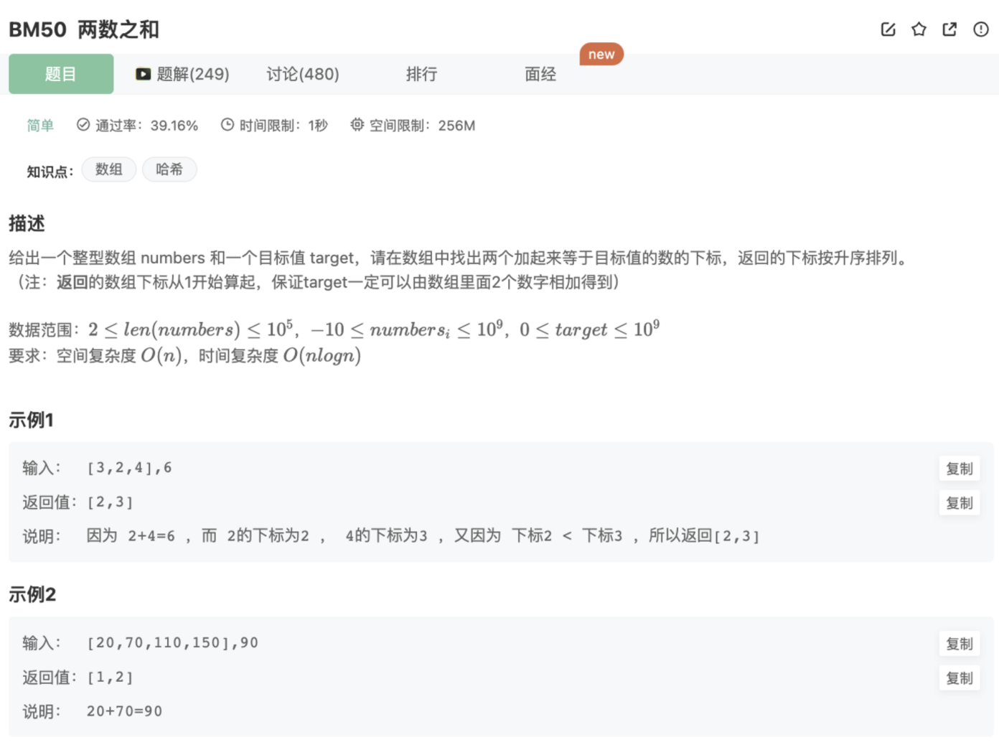

# 两数之和

## 题目




## 代码

```tsx
/**
 * 代码中的类名、方法名、参数名已经指定，请勿修改，直接返回方法规定的值即可
 * 
 * @param numbers int整型一维数组 
 * @param target int整型 
 * @return int整型一维数组
 */
export function twoSum(numbers: number[], target: number): number[] {
    let hash = new Map()
    let res = []
    for(let i=0;i<numbers.length;i++){
        let otherNum = target - numbers[i]
        if(!hash.has(otherNum)){
            hash.set(numbers[i],i)
        }else{
            res.push(hash.get(otherNum)+1)
            res.push(i+1)
        }
    }
    return res
}
```

## 说明

暴力2层循环穷举也可以解决这个问题，但是不符合时间复杂度要求

上面的代码的思路是：**只用一层的循环，结合了一个hash去记录前面的值，匹配到则输出**

上述代码的时间和空间复杂度：

```
* 时间复杂度：O(n)，最多遍历数组一遍，每次查询哈希表都是O(1)
* 空间复杂度：O(n)，最坏情况下找到数组结尾才找到，其他都加入哈希表，哈希表最长 n - 1
```