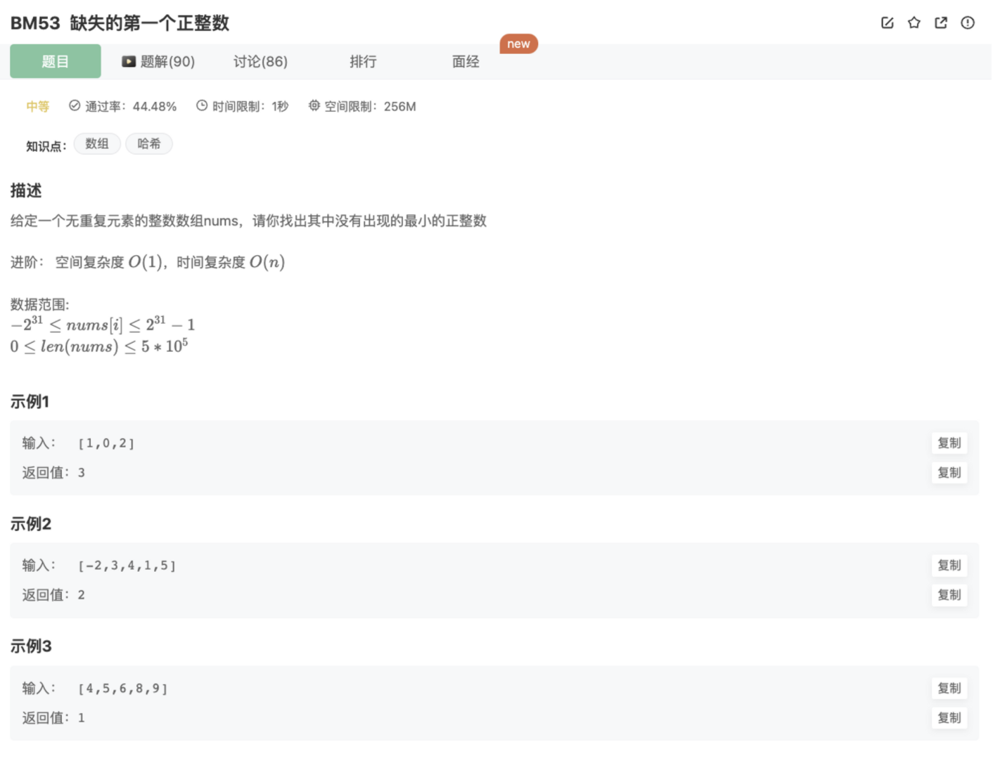

# 缺失的第一个正整数

## 题目




## 代码

```jsx
/**
 * 代码中的类名、方法名、参数名已经指定，请勿修改，直接返回方法规定的值即可
 *
 * 
 * @param nums int整型一维数组 
 * @return int整型
 */
function minNumberDisappeared( nums ) {
    let hash = []
    for(let i=0;i<nums.length;i++){
        if(nums[i] > 0){
            hash[nums[i]] = hash[nums[i]] ? hash[nums[i]]+1 : 1
        }
    }
    let cnt = 1
    while(hash[cnt]){
        cnt++
    }
    return cnt
}
module.exports = {
    minNumberDisappeared : minNumberDisappeared
};
```