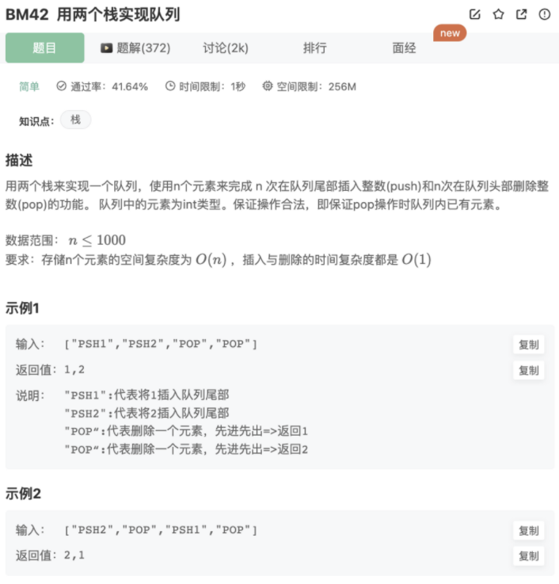

# 用两个栈实现队列

## 题目



## 代码

```jsx
let stack1 = []
let stack2 = []
function push(node)
{
    while(stack2.length){
        stack1.push(stack2.pop())
    }
    stack1.push(node)
}
function pop()
{
    while(stack1.length){
        stack2.push(stack1.pop())
    }
    return stack2.pop()

}
module.exports = {
    push : push,
    pop : pop
};
```

优化：

```jsx
let stack1 = [];
let stack2 = [];
function push(node)
{
  stack1.push(node);
}
function pop()
{
  if(stack2.length == 0){
    while(stack1.length != 0){
      stack2.push( stack1.pop() );
    }
  }
  return stack2.pop();
}
module.exports = {
    push : push,
    pop : pop
};
```