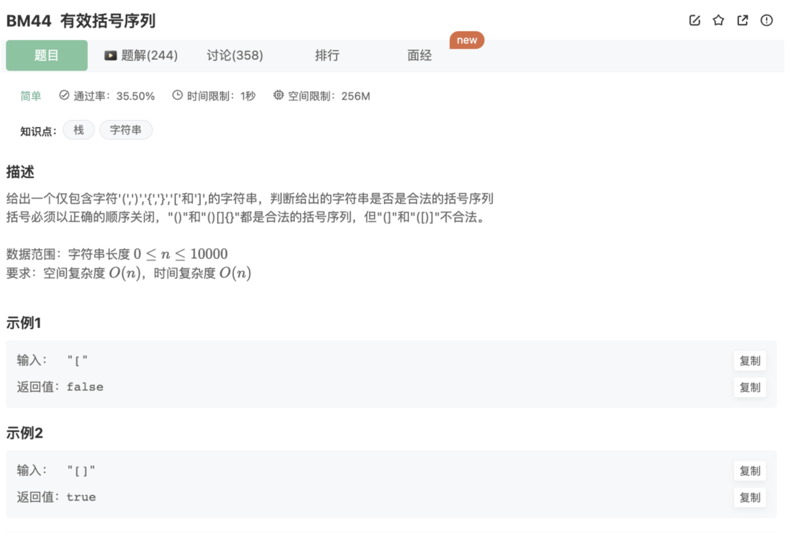

# 有效括号序列

## 题目




## 代码

```jsx
/**
  * 
  * @param s string字符串 
  * @return bool布尔型
  */
function isValid( s ) {
    let stack = []
    let map = {')':'(','}':'{',']':'['}  // 建立映射关系
    let strArr = s.split('')
    for(let i=0;i<strArr.length;i++){
				// 遍历，如果是左边括号，则加入stack
        if('({['.includes(strArr[i])){
            stack.push(strArr[i])
        }else{
						// 如果是右边括号，判断stcak的栈顶元素是否匹配
            if(map[strArr[i]] !== stack.pop())  {
                return false
            }
        }   
    }
		// 遍历完后，如果stack里面清空了，说明一一按顺序匹配了，返回true，否则返回false
    if(stack.length === 0) return true
    return false
}
```