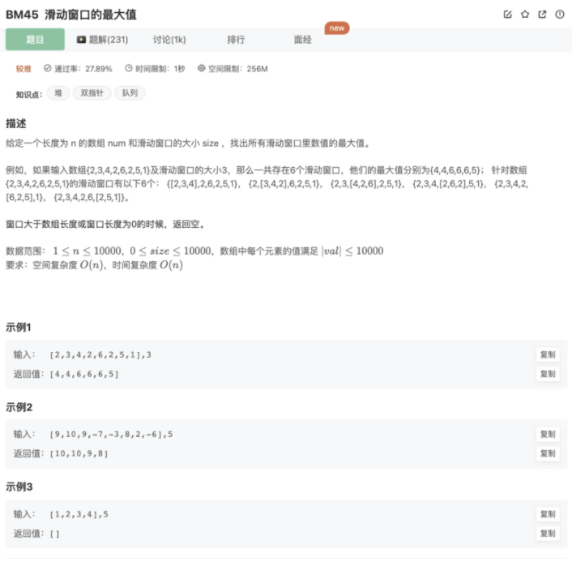

# 滑动窗口的最大值

## 题目




## 代码

1.暴力枚举

```jsx
function maxInWindows(num, size)
{
    // 滑动窗口
    if(size > num.length || !size) return []
    let left = 0
    let right = size-1
    let move = left 
    let res = []
    let max = num[0] 
    while(right <= num.length-1){
        max = num[left]
        move = left
        while(move <= right){
            if(num[move] > max){
                max = num[move]
            }
            move++
        }
        res.push(max)
        left++
        right++
    }
    console.log(res)
    return res
}
module.exports = {
    maxInWindows : maxInWindows
};
```

2.双向队列

如果说队列是一种只允许从尾部进入，从头部出来的线性数据结构，那双向队列就是一种特殊的队列了，双向队列两边，即头部和尾部都可以进行插入元素和删除元素的操作，但是也只能插入到最尾部或者最头部，每次也只能取出头部元素或者尾部元素后才能取出里面的元素。

JS天然集成了这种数据结构

核心思路：遍历，围绕一个数组去处理成第一个是最大值，每次从这个数组第一位拿到最大值

1.搞一个数组，始终使得第一个最大

```jsx
// 去掉比自己先进队列，小于自己的值(意思是保证第一个是最大的即可)
while(dq.length && num[dq[dq.length-1]]<num[i]){
    dq.pop()
}
```

2.遍历，把遍历的值推入数组，超出的去掉，同时看看遍历的值是否是最大，最大则推到上述数组第一个的位置

```jsx
// 查看当前队列里面的值是否超出窗口范围，超出移除处理
        while(dq.length && dq[0] < (i - size + 1)){
            dq.shift()
        }
function maxInWindows(num, size)
{
    if(size > num.length || !size) return []
    // 双向队列
    let res = []
    let dq = []
    // 先遍历一个窗口（初始化）
    for(let i=0;i<size;i++){
        // 去掉比自己先进队列，小于自己的值(意思是保证第一个是最大的即可)
        while(dq.length && num[dq[dq.length-1]]<num[i]){
            dq.pop()
        }
        dq.push(i)
    }
    // 遍历后续数组元素
    for(let i=size;i<num.length;i++){
        // 拿出上一个窗口的最大值
        res.push(num[dq[0]])
        // 查看当前队列里面的值是否超出窗口范围，超出移除处理
        while(dq.length && dq[0] < (i - size + 1)){
            dq.shift()
        }
        // 队列加入新的值，处理方式和之前一致
        while(dq.length && num[dq[dq.length-1]]<num[i]){
            dq.pop()
        }
        dq.push(i)
    }
    res.push(num[dq[0]]);
    return res
}
module.exports = {
    maxInWindows : maxInWindows
};
```