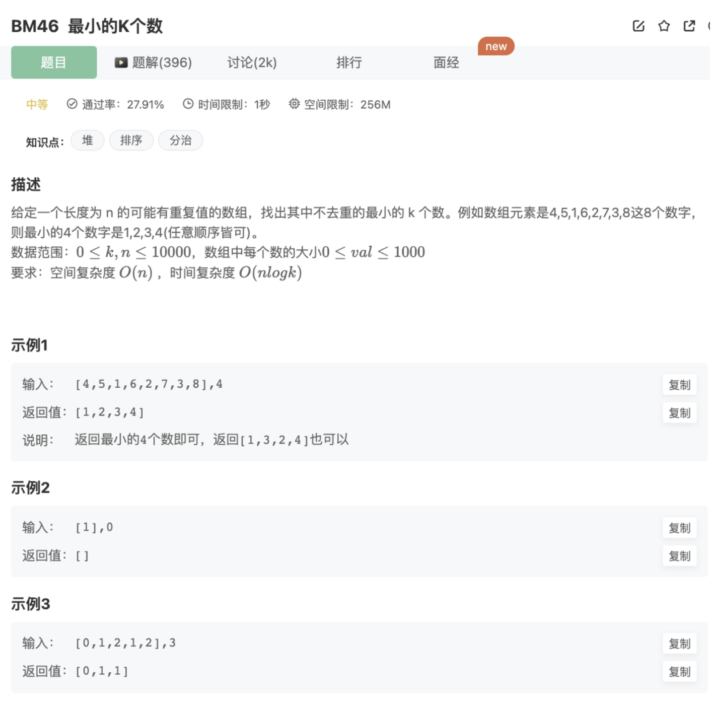

## 题目



## 思路

1.常规排序后，输出前k个

2.使用堆

堆相关知识：

JS实现【堆】数据结构

```jsx
// JS实现最小堆
class MinHeap{
    constructor(){
        this.heap = []
    }
    // 交换节点的值
    swap(i1,i2){
        [this.heap[i1],this.heap[i2]] = [this.heap[i2],this.heap[i1]]
    }
    // 获取父节点
    getParentIndex(index){
        return (index - 1) >> 1 // 相等于 Math.floor((index - 1)/2)
    }
    // 获取左侧节点索引
    getLeftIndex(index){
        return (index << 1) + 1
    }
    // 获取右侧节点索引
    getRightIndex(index){
        return (index << 1) + 2
    }
    // 获得堆顶元素
    peek(){
        return this.heap[0]
    }
    // 获取堆大小
    size(){
        return this.heap.length
    }
    // 上移：把当前结点向上找到合适的位置
    shiftUp(index){
        if( index === 0) return 
        // 获取父节点
        const parentIndex = this.getParentIndex(index)
        // 如果父节点的值大于当前节点的值，则需要交换
        if(this.heap[parentIndex] > this.heap[index]){
            this.swap(parentIndex,index)
            // 然后继续上移
            this.shiftUp(parentIndex)
        }
    }
    // 下移：把当前结点向下找到合适的位置
    shiftDown(index){
        // 获取左右子节点索引
        const leftIndex = this.getLeftIndex(index);
        const rightIndex = this.getRightIndex(index);
        // 判断一下子节点的情况
        let minChild = null
        if(this.heap[leftIndex] === undefined &&  this.heap[rightIndex] === undefined){
            return
        }else if(this.heap[leftIndex]!==undefined && this.heap[rightIndex]!==undefined){
            minChild = this.heap[leftIndex] <= this.heap[rightIndex] ? leftIndex : rightIndex
        }else if(this.heap[leftIndex] !== undefined){
            minChild = leftIndex
        }else if(this.heap[rightIndex] !== undefined){
            minChild = rightIndex
        }
        if(this.heap[minChild] < this.heap[index]){
            this.swap(minChild,index)
            this.shiftDown(minChild)
        }
    }
    // 删除堆顶元素：其实就是和最后一个元素交换值，移除最后一个元素，然后执行shiftDown将堆顶元素放到合适的位置
    pop(){
        this.swap(0,this.size()-1)
        let peekEle = this.heap.pop()
        this.shiftDown(0)
        return peekEle
    }
    // heap插入一个新的值
    insert(value){
        // 插入到堆的底部
        this.heap.push(value)
        // 然后上移，直到父节点<=这个值
        this.shiftUp(this.heap.length - 1)
    }
}
```

建堆的2种方法：

1.一个个插入

```jsx
let minHeap = new MinHeap()
for(let i=0;i<input.length;i++){
    minHeap.insert(input[i]) // 插到最后，疯狂上移找到合适位置
}
```

2.length/2位置递减，一个个调整成最小堆

```jsx
for(let i=Math.floor(minHeap.heap.length/2);i>=0;i--){
	minHeap.shiftDown(i)
}
```

堆排序：

思路：调用pop()拿到堆顶最小元素，加入新数组

```jsx
let sortRes = []    
for(let i=0;i<this.minHeap.size();i++){
    let min = minHeap.pop()
    sortRes.push(min)
}
```

## 代码

```jsx
function GetLeastNumbers_Solution(input, k)
{
    // JS实现最小堆
    class MinHeap{
        constructor(){
            this.heap = []
        }
        // 交换节点的值
        swap(i1,i2){
            [this.heap[i1],this.heap[i2]] = [this.heap[i2],this.heap[i1]]
        }
        // 获取父节点
        getParentIndex(index){
            return (index - 1) >> 1 // 相等于 Math.floor((index - 1)/2)
        }
        // 获取左侧节点索引
        getLeftIndex(index){
            return (index << 1) + 1
        }
        // 获取右侧节点索引
        getRightIndex(index){
            return (index << 1) + 2
        }
        // 获得堆顶元素
        peek(){
            return this.heap[0]
        }
        // 获取堆大小
        size(){
            return this.heap.length
        }
        // 上移：把当前结点向上找到合适的位置
        shiftUp(index){
            if( index === 0) return 
            // 获取父节点
            const parentIndex = this.getParentIndex(index)
            // 如果父节点的值大于当前节点的值，则需要交换
            if(this.heap[parentIndex] > this.heap[index]){
                this.swap(parentIndex,index)
                // 然后继续上移
                this.shiftUp(parentIndex)
            }
        }
        // 下移：把当前结点向下找到合适的位置
        shiftDown(index){
            // 获取左右子节点索引
            const leftIndex = this.getLeftIndex(index);
            const rightIndex = this.getRightIndex(index);
            // 判断一下子节点的情况
            let minChild = null
            if(this.heap[leftIndex] === undefined &&  this.heap[rightIndex] === undefined){
                return
            }else if(this.heap[leftIndex]!==undefined && this.heap[rightIndex]!==undefined){
                minChild = this.heap[leftIndex] <= this.heap[rightIndex] ? leftIndex : rightIndex
            }else if(this.heap[leftIndex] !== undefined){
                minChild = leftIndex
            }else if(this.heap[rightIndex] !== undefined){
                minChild = rightIndex
            }
            if(this.heap[minChild] < this.heap[index]){
                this.swap(minChild,index)
                this.shiftDown(minChild)
            }
        }
        // 删除堆顶元素：其实就是和最后一个元素交换值，移除最后一个元素，然后执行shiftDown将堆顶元素放到合适的位置
        pop(){
            this.swap(0,this.size()-1)
            let peekEle = this.heap.pop()
            this.shiftDown(0)
            return peekEle
        }
        // heap插入一个新的值
        insert(value){
            // 插入到堆的底部
            this.heap.push(value)
            // 然后上移，直到父节点<=这个值
            this.shiftUp(this.heap.length - 1)
        }
    }

    // 使用最小堆求解
    let minHeap = new MinHeap()
    for(let i=0;i<input.length;i++){
        minHeap.insert(input[i])
    }
    let res = []
    for(let i=0;i<k;i++){
        let min = minHeap.pop()
        console.log(min)
        res.push(min)
    }
    return res

}
module.exports = {
    GetLeastNumbers_Solution : GetLeastNumbers_Solution
};
```