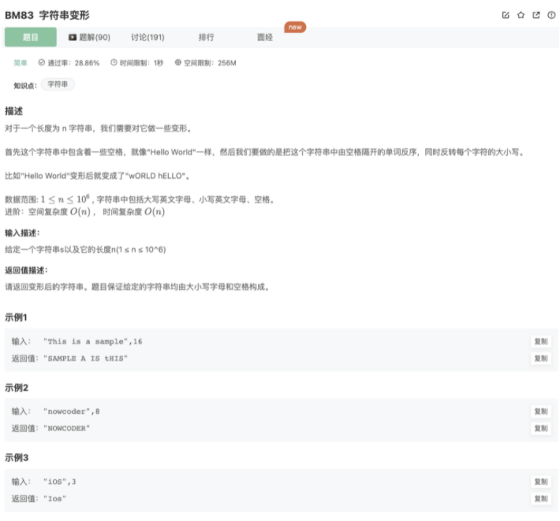

# 字符串变形

## 题目




## 代码

```jsx
function trans(s, n){
    s = s.split(' ').reverse().join(' ').split('')
    for(let i=0;i<s.length;i++){
        if(/[A-Z]/.test(s[i])){
            s[i] = s[i].toLowerCase()
        }else if(/[a-z]/.test(s[i])) s[i] = s[i].toUpperCase()
    }
    return s.join('')
}

module.exports = {
    trans : trans
}
```