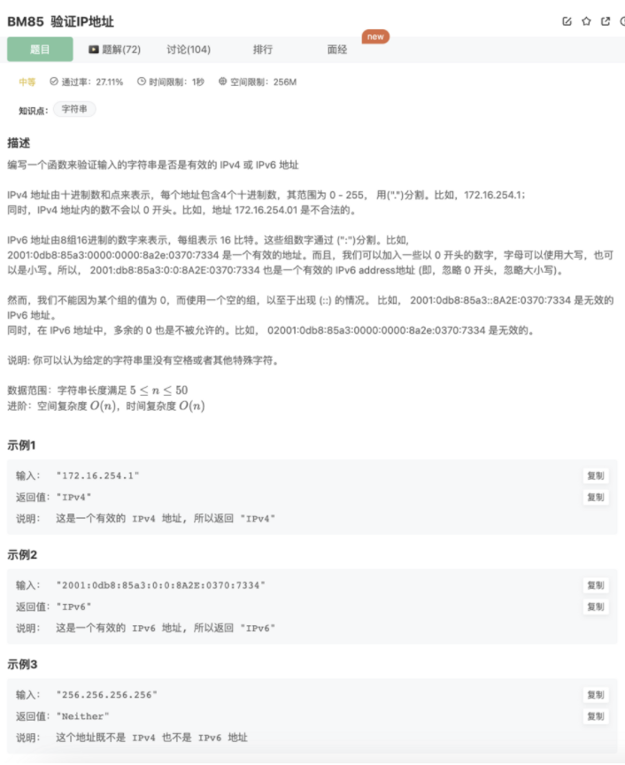

# 验证IP地址

## 题目




## 代码

正则

```jsx
/**
 * 验证IP地址
 * @param IP string字符串 一个IP地址字符串
 * @return string字符串
 */
function solve( IP ) {
    const IPv4 = 'IPv4'
    const IPv6 = 'IPv6'
    const Neither = 'Neither'
    // 
    if(IP.includes('.') && IP.split('.').length !== 4){
        return Neither
    }    
    // 
    if(IP.includes(':') && IP.split(':').length !== 8){
        return Neither
    }
    // 
    if(IP.includes('') && IP.split('.').length === 4){
        let IPArr = IP.split('.')
        for(let i=0;i<IPArr.length;i++){
            if(IPArr[i].length === 0) return Neither
            if(/^0/.test(IPArr[i])) return Neither
            if(/[^0-9]/.test(IPArr[i])) return Neither
            if(Number(IPArr[i]) > 255) return Neither
        }
        return IPv4
    }
    // 
    if(IP.includes(':') && IP.split(':').length === 8){
        let IPArr = IP.split(':')
        for(let i=0;i<IPArr.length;i++){
            console.log(IPArr[i])
            if(IPArr[i].length === 0) return Neither
            if(/[^0-9a-eA-E]/.test(IPArr[i])) return Neither
            if(/^0{2,}/.test(IPArr[i])) return Neither
        }
        return IPv6
    }

}
module.exports = {
    solve : solve
};
```