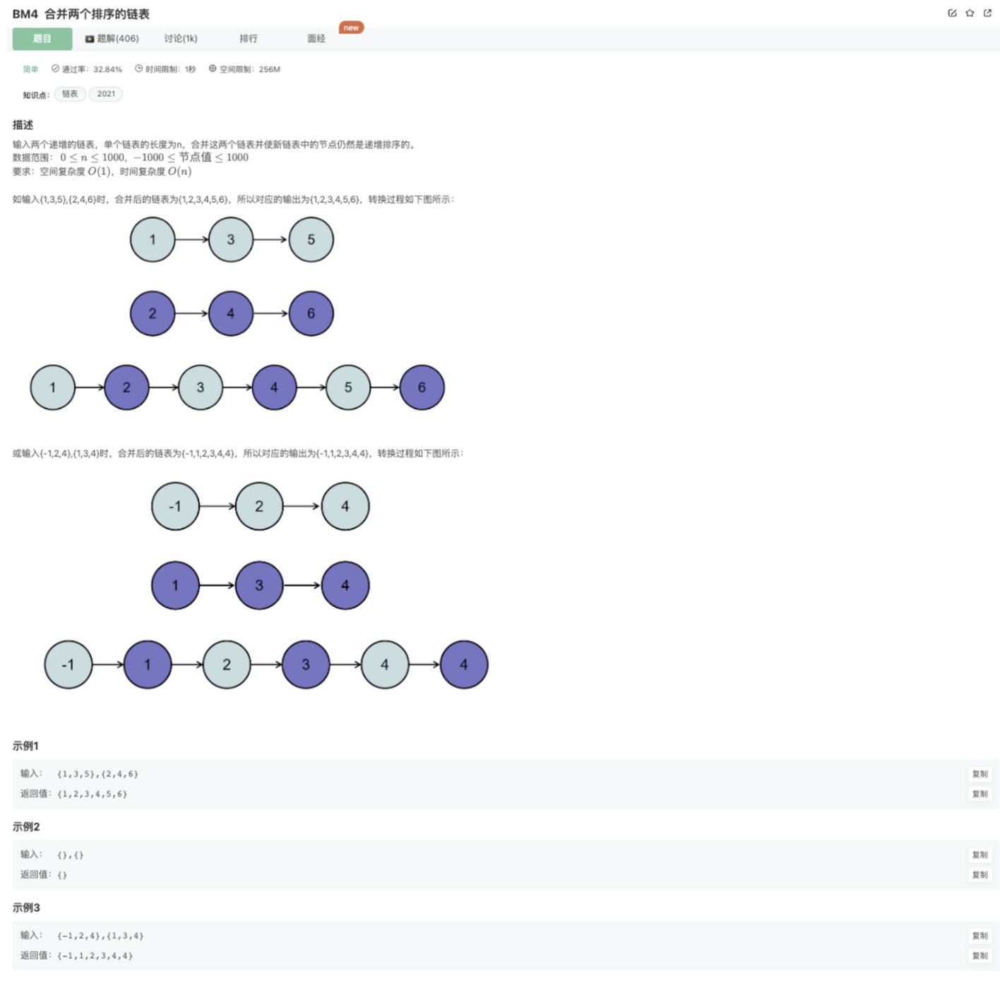

# 合并两个排序的链表

## 题目



## 代码

事实上，这是归并排序复原时候的操作

```jsx
/*function ListNode(x){
    this.val = x;
    this.next = null;
}*/
function Merge(pHead1, pHead2)
{
    let pHead = new ListNode(0)
    let result = pHead
    // 比较2个链表指针的值
    while(pHead1 && pHead2){
        if(pHead1.val < pHead2.val){
            pHead.next = pHead1
            pHead1 = pHead1.next
        }else{
            pHead.next = pHead2
            pHead2 = pHead2.next
        } 
            pHead = pHead.next
    }
    if(pHead1) pHead.next = pHead1
    if(pHead2) pHead.next = pHead2
    return result.next
}
module.exports = {
    Merge : Merge
};
```

## 其他解法

### 递归

将问题分解，求解子问题得到最终的解

```jsx
public class Solution {
    public ListNode Merge(ListNode list1,ListNode list2) {
        // list1 list2为空的情况
        if(list1 == null || list2 == null){
            return list1 != null ? list1 : list2;
        }
        // 两个链表元素依次对比
        if(list1.val <= list2.val){
            // 递归计算 list1.next, list2
            list1.next = Merge(list1.next, list2);
            return list1;
        }else{
            // 递归计算 list1, list2.next
            list2.next = Merge(list1, list2.next);
            return list2;
        } 
    }
}
```

### 借助额外数组

(1) 创建额外存储数组 nums (2) 依次循环遍历 pHead1, pHead2，将链表中的元素存储到 nums中，再对nums进行排序 (3) 依次对排序后的数组 nums取数并构建合并后的链表

```jsx
public class Solution {
    public ListNode Merge(ListNode list1,ListNode list2) {
        // list1 list2为空的情况
        if(list1==null) return list2;
        if(list2==null) return list1;
        if(list1 == null && list2 == null){
            return null;
        }
        //将两个两个链表存放在list中
        ArrayList<Integer> list = new ArrayList<>();
        // 遍历存储list1
        while(list1!=null){
            list.add(list1.val);
            list1 = list1.next;
        }
        // 遍历存储list2
        while(list2!=null){
            list.add(list2.val);
            list2 = list2.next;
        }
        // 对 list 排序
        Collections.sort(list);
        // 将list转换为 链表
        ListNode newHead = new ListNode(list.get(0));
        ListNode cur = newHead;
        for(int i=1;i<list.size();i++){
            cur.next = new ListNode(list.get(i));
            cur = cur.next;
        }
        // 输出合并链表
        return newHead;
    }
}
```