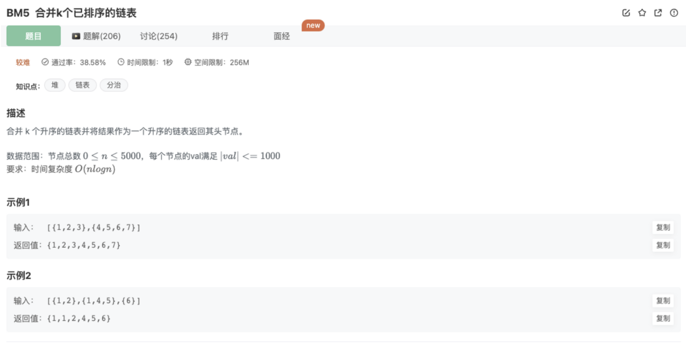

# 合并K个已经排序的链表

## 题目



## 代码

```jsx
/*
 * function ListNode(x){
 *   this.val = x;
 *   this.next = null;
 * }
 */

/**
 * 
 * @param lists ListNode类一维数组 
 * @return ListNode类
 */
function mergeKLists( lists ) {
    if(lists.length === 0) return 

    let pHead = new ListNode(0)
    let result = pHead

    let count = 0
    let min = null
    while(count < lists.length){ // 如果数组里面到达结尾的链表没有完全满
        count = 0
				// 拿到不为null的第一个链表头 
        for(let k=0;k<lists.length;k++){
            if(lists[k]){
                min = [k,lists[k].val]  
                break
            }
        }
				// 拿到目前各个链表头节点中的最小值
        for(let i=0;i<lists.length;i++){
            if(!lists[i]) {
                count++   // 统计到达结尾的链表
                continue
            }
            if(lists[i].val <= min[1]){  
                min = [i,lists[i].val] 
            }
        }
        // 如果count==lists.length,说明节点已经处理完毕，否则在结果链表中加入当前min
        if(count != lists.length){
            pHead.next = lists[min[0]]
            pHead = pHead.next
            lists[min[0]] = lists[min[0]].next
        }
    }
    return result.next
}
module.exports = {
    mergeKLists : mergeKLists
};
```

## 官方题解

### 1.归并排序思想

知识点：

1）双指针

双指针是指在遍历对象的过程中，不是普通的使用单个指针进行访问，而是使用2个指针

2个指针或是**同方向访问2个链表**、或是同方向访问一个链表（**快慢指针**）、或是相反方向扫描（**对撞指针**）

2）分治

分治即分而治之

“分”指的是将一个大而复杂的问题划分成多个性质相同但是规模更小的子问题，子问题继续按照这样划分，直到问题被解决

“治”指的是将子问题单独进行处理。经过分治后的子问题，需要将解进行合并才能得到原问题的解，因此整个分治过程经常使用递归来实现

归并排序是什么？简单来说就是将一个数组每次划分成等长的两部分，对两部分进行排序即是子问题。对子问题继续划分，直到子问题只有1个元素。还原的时候呢，将每个子问题和它相邻的另一个子问题利用上述双指针的方式，1个与1个合并成2个，2个与2个合并成4个，因为这每个单独的子问题合并好的都是有序的，直到合并成原本长度的数组。

对于这k个链表，就相当于上述合并阶段的k个子问题，需要划分为链表数量更少的子问题，直到每一组合并时是两两合并，然后继续往上合并，这个过程基于递归

具体做法：

- step 1：从链表数组的首和尾开始，每次划分从中间开始划分，划分成两半，得到左边*n*/2个链表和右边*n*/2个链表
- step 2：继续不断递归划分，直到每部分链表数为1
- step 3：将划分好的相邻两部分链表，按照[两个有序链表合并](https://www.nowcoder.com/practice/a479a3f0c4554867b35356e0d57cf03d?tpId=295&sfm=html&channel=nowcoder)的方式合并，合并好的两部分继续往上合并，直到最终合并成一个链表

```jsx
import java.util.ArrayList;
public class Solution {
    //两个链表合并函数
    public ListNode Merge(ListNode list1, ListNode list2) { 
        //一个已经为空了，直接返回另一个
        if(list1 == null) 
            return list2;
        if(list2 == null)
            return list1;
        //加一个表头
        ListNode head = new ListNode(0); 
        ListNode cur = head;
        //两个链表都要不为空
        while(list1 != null && list2 != null){ 
            //取较小值的节点
            if(list1.val <= list2.val){ 
                cur.next = list1;
                //只移动取值的指针
                list1 = list1.next; 
            }else{
                cur.next = list2;
                //只移动取值的指针
                list2 = list2.next; 
            }
            //指针后移
            cur = cur.next; 
        }
        //哪个链表还有剩，直接连在后面
        if(list1 != null) 
            cur.next = list1;
        else
            cur.next = list2;
        //返回值去掉表头
        return head.next; 
    }
    
    //划分合并区间函数
    ListNode divideMerge(ArrayList<ListNode> lists, int left, int right){ 
        if(left > right) 
            return null;
        //中间一个的情况
        else if(left == right) 
            return lists.get(left);
        //从中间分成两段，再将合并好的两段合并
        int mid = (left + right) / 2; 
        return Merge(divideMerge(lists, left, mid), divideMerge(lists, mid + 1, right));
    }
    
    public ListNode mergeKLists(ArrayList<ListNode> lists) {
        //k个链表归并排序
        return divideMerge(lists, 0, lists.size() - 1);
    }
}
```

复杂度分析

- 时间复杂度：*O*(*nlog*2*k*)，其中*n*为所有链表的总节点数，分治为二叉树型递归，最坏情况下二叉树每层合并都是*O*(*n*)个节点，因为分治一共有*O*(*log*2*k*)层
- 空间复杂度：*O*(*log*2*k*)，最坏情况下递归*log*2*k*层，需要*log*2*k*的递归栈

### 2.优先队列

优先队列即PriorityQueue，是一种内置的机遇堆排序的容器，分为大顶堆与小顶堆，大顶堆的堆顶为最大元素，其余更小的元素在堆下方，小顶堆与其刚好相反。且因为容器内部的次序基于堆排序，因此每次插入元素时间复杂度都是O(log2n)而每次取出堆顶元素都是直接取出。

思路：

如果非要按照归并排序的合并思路，双指针不够用，我们可以直接准备kk*k*个指针，每次比较得出kk*k*个数字中的最小值。为了快速比较kk*k*个数字得到最小值，我们可以利用Java提供的PriorityQueue或者C++SLT提供的优先队列或者Python提供的PriorityQueue可以实现，它是一种参照堆排序的容器，容器中的元素是有序的，如果是小顶堆，顶部元素就是最小的，每次可以直接取出最小的元素。也就是说

每次该容器中有k个元素，我们可以直接拿出最小的元素，再插入下一个元素，相当于每次都是链表的k个指针在比较大小，只移动最小元素的指针。

具体做法：

- step 1：不管是Java还是C++都需要重载比较方法，构造一个比较链表节点大小的小顶堆。（Python版本直接加入节点值）
- step 2：先遍历k个链表头，将不是空节点的节点加入优先队列。
- step 3：每次依次弹出优先队列中的最小元素，将其连接在合并后的链表后面，然后将这个节点在原本链表中的后一个节点（如果不为空的话）加入队列，类似上述归并排序双指针的过程。

```jsx
import java.util.*;
public class Solution {
    public ListNode mergeKLists(ArrayList<ListNode> lists) {
        //小顶堆
        Queue<ListNode> pq = new PriorityQueue<>((v1, v2) -> v1.val - v2.val); 
        //遍历所有链表第一个元素
        for(int i = 0; i < lists.size(); i++){ 
            //不为空则加入小顶堆
            if(lists.get(i) != null) 
                pq.add(lists.get(i));
        }
        //加一个表头
        ListNode res = new ListNode(-1); 
        ListNode head = res;
        //直到小顶堆为空
        while(!pq.isEmpty()){ 
            //取出最小的元素
            ListNode temp = pq.poll(); 
            //连接
            head.next = temp; 
            head = head.next;
            //每次取出链表的后一个元素加入小顶堆
            if(temp.next != null) 
                pq.add(temp.next);
        }
        //去掉表头
        return res.next; 
    }
}
```