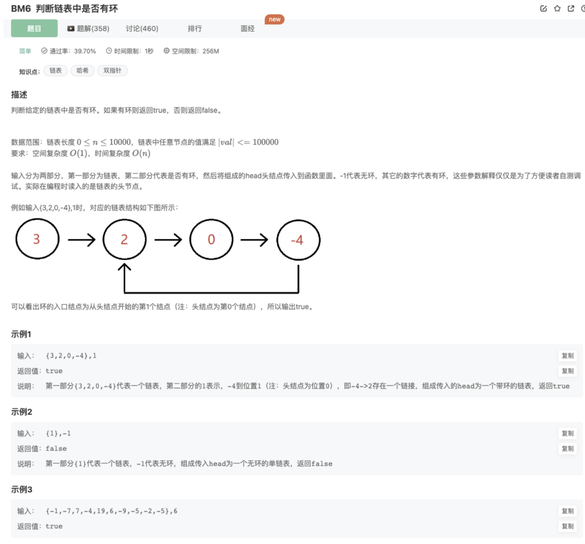

# 判断链表是和否有环

## 题目



## 代码

### 1.双指针

我们使用两个指针，fast 与 slow。 它们起始都位于链表的头部。随后，slow 指针每次向后移动一个位置，而fast 指针向后移动两个位置。如果链表中存在环，则 fast 指针最终将再次与 slow 指针在环中相遇。

```jsx
function hasCycle( head ) {
    // 处理异常数据
    if(!head || !head.next) return 
	// 使用快慢指针求解
	    let fast = head
	    let slow = head
	    while(slow){
	        slow = slow.next
	        fast = fast.next ? fast.next.next : null
	        if(!fast) return false
	        if(slow === fast) return true
	    }
	    return false
}
```

复杂度分析：

时间复杂度O(N)：其中 N 为链表中节点的数目。在最初判断快慢指针是否相遇时，slow 指针走过的距离不会超过链表的总长度

空间复杂度O(1)：额外使用的指针占用常数空间

### 2.哈希表

我们遍历链表中的每个节点，并将它记录下来；一旦遇到了此前遍历过的节点，就可以判定链表中存在环。借助哈希表可以很方便地实现 1、遍历链表，并将访问过的结点存储到哈希表中 2、判断结点是否在哈希表中，若存在则返回 true 3、遍历结束，则返回 false

```java
function hasCycle( head ) {
    // 处理异常数据
    if(!head || !head.next) return 

    // 使用hash求解
    let hash = new Map()
    let cur = head
    while(cur){
        if(hash.get(cur)) return true
        hash.set(cur,true)
        cur = cur.next
    }
    return false
```

复杂度分析：

时间复杂度O(N)：其中 N 为链表中节点的数目。遍历整个链表的结点

空间复杂度O(N)：其中 N 为链表中节点的数目。我们需要将链表中的每个节点都保存在哈希表当中。