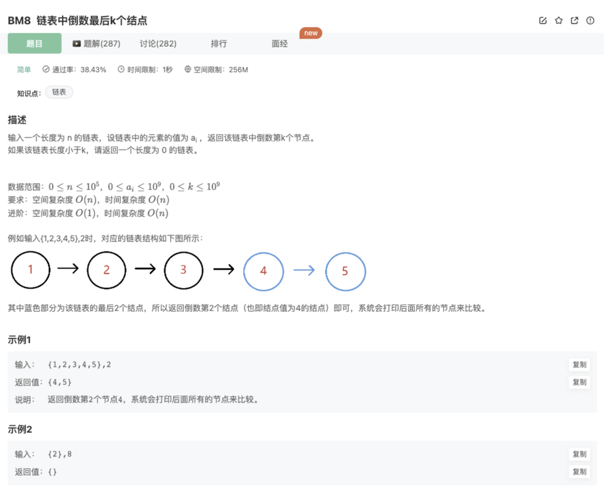
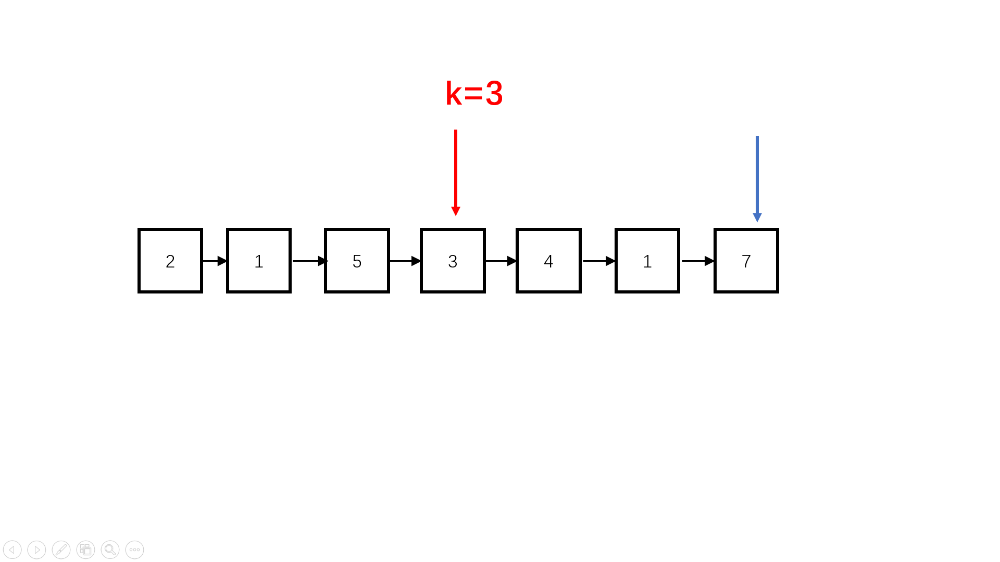

# 链表中倒数最后k个结点

# 题目



## 代码

思路：

因为链表不能知道长度，也不能由后面向前面遍历

因此，我们可以尝试翻转，然后在遍历k个找到该元素

但是找到了之后，因为之前翻转过，所以要再翻转一次才能达到题目要求

```jsx
function FindKthToTail( pHead ,  k ) {
    // 思路：翻转后按顺序查找第K个节点
    let newList = reverseList(pHead)
    console.log(newList)
    let res = newList
    while(k-1){
        if(!newList || !newList.next) return
        newList = newList.next
        k--
    }
    newList.next = null
    return reverseList(res)

    function reverseList(node){
        if(!node || !node.next) return node
        let cur = node
        let pre = null
        while(cur){
            let next = cur.next
            cur.next = pre
            pre = cur
            cur = next
        }
        return pre
    }
}
```

## 其他解法

1.快慢指针

思路：

我们无法逆序遍历链表，就很难得到链表的倒数第k个元素，那我们可以试试反过来考虑，如果当前我们处于倒数第k的位置上，即距离链表尾的距离是k，那我们假设双指针指向这两个位置，二者步向前移动，当前面个指针到了链表头的时候，两个指针之间的距离还是k。虽然我们没有办法让指针逆向移动，但是我们刚刚这个思路却可以正向实施。

具体做法：

- step 1：准备一个快指针，从链表头开始，在链表上先走*k*步
- step 2：准备慢指针指向原始链表头，代表当前元素，则慢指针与快指针之间的距离一直都是k
- step 3：快慢指针同步移动，当快指针到达链表尾部的时候，慢指针到了倒数*k*个元素的位置



```java
import java.util.*;
public class Solution {
    public ListNode FindKthToTail (ListNode pHead, int k) {
        int n = 0;
        ListNode fast = pHead; 
        ListNode slow = pHead;
        //快指针先行k步
        for(int i = 0; i < k; i++){  
            if(fast != null)
                fast = fast.next;
            //达不到k步说明链表过短，没有倒数k
            else 
                return slow = null;
        }
        //快慢指针同步，快指针先到底，慢指针指向倒数第k个
        while(fast != null){ 
            fast = fast.next;
            slow = slow.next;
        }
        return slow;
    }
}
```

2.先找长度然后找k

思路：

链表不能逆向遍历，也不能直接访问。但是对于倒数第k个位置，我们只需要知道是正数多少位还是可以直接遍历得到的

具体做法：

- step 1：可以先遍历一次链表找到链表的长度
- step 2：然后比较链表长度是否比*k*小，如果比*k*小返回一个空节点
- step 3：如果链表足够长，则我们从头节点往后遍历*n*−*k*次即可找到所求

```java
import java.util.*;
public class Solution {
    public ListNode FindKthToTail (ListNode pHead, int k) {
        int n = 0;
        ListNode p = pHead;
         //遍历链表，统计链表长度
        while(p != null){
            n++;
            p = p.next;
        }
        //长度过小，返回空链表
        if(n < k) 
            return null;
        p = pHead;
        //遍历n-k次
        for(int i = 0; i < n - k; i++) 
            p = p.next;
        return p;
    }
}
```