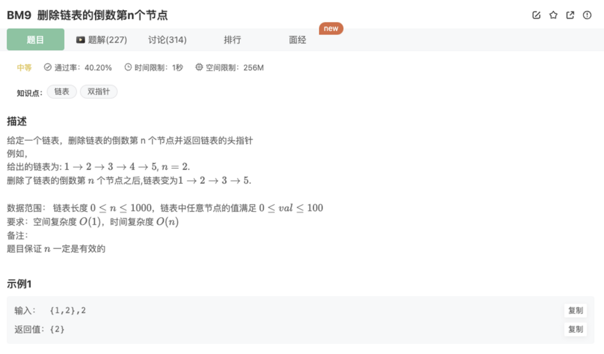

# 删除链表的倒数第n个结点

## 题目



## 代码

沿用了BM8中翻转的思路

```jsx
function removeNthFromEnd( head ,  n ) {
    // 思路：翻转后按顺序查找第n个节点和他的前后节点
    let curNode = reverseList(head)
    let res = curNode
    let preNode,nextNode
    if(n!==1){
      while(n-1){
        if(!curNode || !curNode.next) return
        preNode = curNode
        curNode = curNode.next
        nextNode = curNode.next
        n--
      }
      curNode.next = null
      preNode && (preNode.next = nextNode)
    }else{
      res = curNode.next
    }
    return reverseList(res)

    function reverseList(node){
        if(!node || !node.next) return node
        let cur = node
        let pre = null
        while(cur){
            let next = cur.next
            cur.next = pre
            pre = cur
            cur = next
        }
        return pre
    }
}
```

## 官方题解

1.双指针

严重BM8中双指针的思路

步骤如下：

- step 1：给链表添加一个表头，处理删掉第一个元素时比较方便
- step 2：准备一个快指针，在链表上先走*n*步
- step 3：准备慢指针指向原始链表头，代表当前元素，前序节点指向添加的表头，这样两个指针之间相距就是一直都是n
- step 4：快慢指针同步移动，当快指针到达链表尾部的时候，慢指针到了倒数*n*个元素的位置
- step 5：最后将该节点前序节点的指针指向该节点后一个节点，删掉这个节点


注意在【删除头节点的时候避免做特殊处理】和【保存前一个节点】使用了【头插法】


2.先获取长度再找节点

沿用BM8中的思路

也是注意【头插法】在处理头节点和保存前一个节点的作用