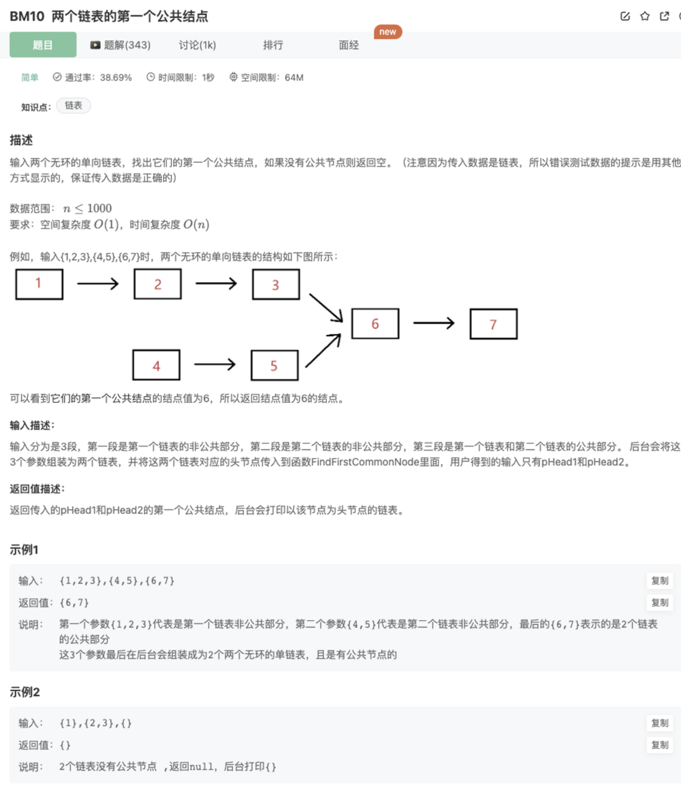

# 两个链表的第一个公共结点

## 题目



## 代码

1.双指针

交换接着行走，第一个相遇的结点即公共结点

```jsx
function FindFirstCommonNode(pHead1, pHead2)
{
    if(!pHead1 || !pHead2) return  
    // 双指针：交换各走1次，长度相等，如果有公共结点，那么将会相遇
    let point1 = pHead1
    let point2 = pHead2
    let cnt = 0
    while(point1 != point2 && cnt < 2){
        point1 = point1.next
        if(!point1) {
            point1 = pHead2 
            cnt++
        }
        point2 = point2.next
        if(!point2) point2 = pHead1
    }
    if(cnt === 2) return 
    return point1
}
```

2.双指针

找出长度差gap，长度长的先走gap步，然后再同步行走，第一个相遇的结点即公共结点

```jsx
function FindFirstCommonNode(pHead1, pHead2)
{
    if(!pHead1 || !pHead2) return  
    // 双指针2
    let len1 = getLength(pHead1)
    let len2 = getLength(pHead2)
    let gap = Math.abs(len1-len2)
		// 长度长的先走gap步追平差距
    len1 > len2 ? pHead1 = runGapStep(pHead1,gap) : pHead2 = runGapStep(pHead2,gap)
    // 然后同步行走，第一个相遇的结点即位公共结点
		while(pHead1 !== pHead2 && pHead1 && pHead2){
        pHead1 = pHead1.next
        pHead2 = pHead2.next
    }
    if(!pHead1 || !pHead2) return
    return pHead1

    function runGapStep(head,gap){
        while(gap){
            head = head.next
            gap--
        }
        return head
    }
    function getLength(head){
        if(!head) return 0
        let cnt = 0
        while(head){
            cnt++
            head = head.next
        }
        return cnt
    }
}
```

3.map

遍历链表1，结点加入map

遍历链表2，查询map是否存在结点，有则是第一个公共结点，返回

```jsx
function FindFirstCommonNode(pHead1, pHead2)
{
    if(!pHead1 || !pHead2) return  
    // map
    const map = new Map()
    while(pHead1){
        map.set(pHead1,true)
        pHead1 = pHead1.next
    }
    while(pHead2){
        if(map.get(pHead2)) return pHead2
        pHead2 = pHead2.next
    }
    return 
}
```