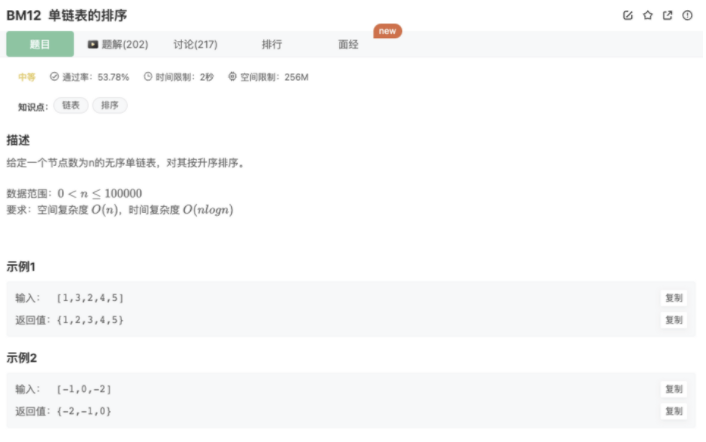

# 单链表的排序

## 题目



## 思路

涉及到的其他知识点是排序和递归回溯（DFS）

这个其实也是排序，这个排序是归并排序的链表版本

让我们回忆一下【归并排序】的思路：

事实上，【归并排序】其实就是左右DFS（一种情况遍历到底后再遍历其他情况的算法）+ while遍历排序得出本轮结果 的一种算法

```jsx
// 分治递归和回溯
function mergeSort(arr){
	let res = []
	if(arr.length === 1) return arr // 递归的终点

	let midIndex = arr.length >> 1 // 找中点，相当于Math.floor(arr.length/2)

	let leftArr = arr.slice(0,midIndex) // 拿到左边的数组
	let rightArr = arr.slice(midIndex) // 拿到右边的数组
	
	let sortLeftArr = mergeSort(leftArr) // 递归处理左边，直到分治的左边数组为1
	let sortRightArr = mergeSort(rightArr) // 递归处理右边，直到分治右边数组为1
	
  // 对本轮递归形成的sorted数组再进行排序
	while(sortLeftArr.length > 0 || sortRightArr.length > 0){
		if(sortLeftArr.length > 0 && sortRightArr.length > 0){
			res.push(sortLeftArr[0] < sortRightArr[0] ? sortLeftArr.shift() : sortRightArr.shift())
		}else if(sortLeftArr.length > 0){
			res.push(sortLeftArr.shift())
		}else if(sortRightArr.length > 0){
			res.push(sortRightArr.shift())
		}
	
// 结束本轮递归，得到本轮结果：将本轮左右数组排序好的新数组
	return res
}
```

让我们回到链表排序这道题看看：

不同的地方在于：

1. 归并排序找中点利用的是length/2，而链表无法提前知道长度，所以这里利用了快慢指针去找中点

   初始值：`slow=head; fast = slow.next`

   在初始值的基础上，slow每次移动一格，fast每次移动2格，注意继续前进查找的值（fast不存在代表到了奇数链表数的中点，fast的next不存在代表到达偶数链表数的中点，这是通过模拟推导出来的条件值）

   ```jsx
   while(fast && fast.next){ 
   	slow = slow.next
   	fast = fast.next.next
   }
   ```

2. 由于链表的特性，需要将找到的左边链表的末尾next置为null

3. 类似归并排序，对完成本轮任务的链表进行排序

```jsx
 // 对本轮递归形成的sorted数组再进行排序
	while(sortLeftArr.length > 0 || sortRightArr.length > 0){
		if(sortLeftArr.length > 0 && sortRightArr.length > 0){
			res.push(sortLeftArr[0] < sortRightArr[0] ? sortLeftArr.shift() : sortRightArr.shift())
		}else if(sortLeftArr.length > 0){
			res.push(sortLeftArr.shift())
		}else if(sortRightArr.length > 0){
			res.push(sortRightArr.shift())
		}
```

## 代码

```jsx
/*
 * function ListNode(x){
 *   this.val = x;
 *   this.next = null;
 * }
 */

/**
 * @param head ListNode类 the head node
 * @return ListNode类
 */
function sortInList( head ) {
    // 利用归并排序的思路解决本题 左右递归（分治）+ 每轮排序
    if(!head || !head.next) return head // 递归终点
    // 找中点，链表使用快慢指针去找中点
    let slow = head
    let fast = head.next 
    while(fast && fast.next){
        slow = slow.next
        fast = fast.next.next
    }
    let right = slow.next   // 找到右侧链表
    slow.next = null // 处理左侧链表的结尾为null
    // 开始DFS递归
    let leftList = sortInList(head) 
    let rightList = sortInList(right)
    // 完成本轮的左右（sorted）链表排序
    let pointer = new ListNode(-1)
    let res = pointer
    while(leftList && rightList){
        if(leftList.val <= rightList.val){
            pointer.next = leftList
            leftList = leftList.next
        }else{
            pointer.next = rightList
            rightList = rightList.next
        }
        pointer = pointer.next
    }
    pointer.next = leftList ? leftList : rightList
    return res.next    
}
module.exports = {
    sortInList : sortInList
};
```