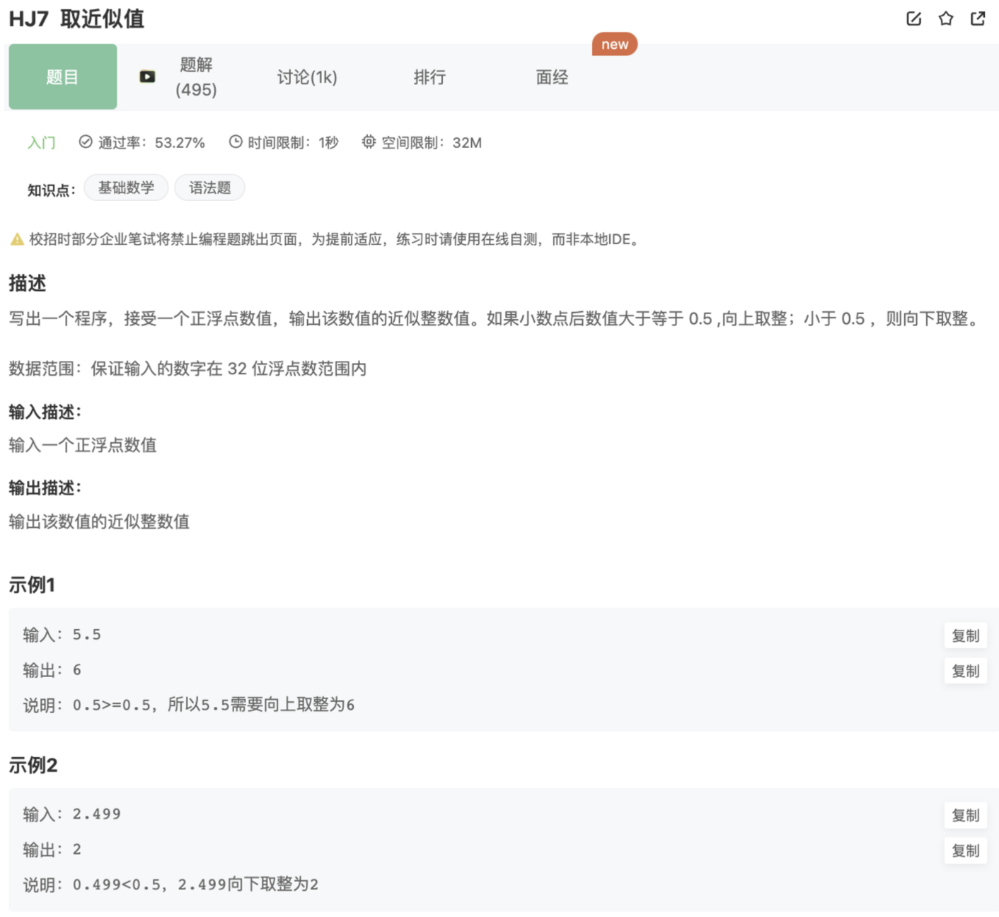

# 取近似值

## 题目



## 思路

1.直接使用JS的Math.round()API

2.对1取余判断小数是否大于0.5，如果大于则+1，小于则取整即可

```jsx
const rl = require("readline").createInterface({ input: process.stdin });
var iter = rl[Symbol.asyncIterator]();
const readline = async () => (await iter.next()).value;

void async function () {
    // Write your code here
    while(line = await readline()){
        console.log(Math.round(line));
    }
}()
```

这里用到了nodejs的API