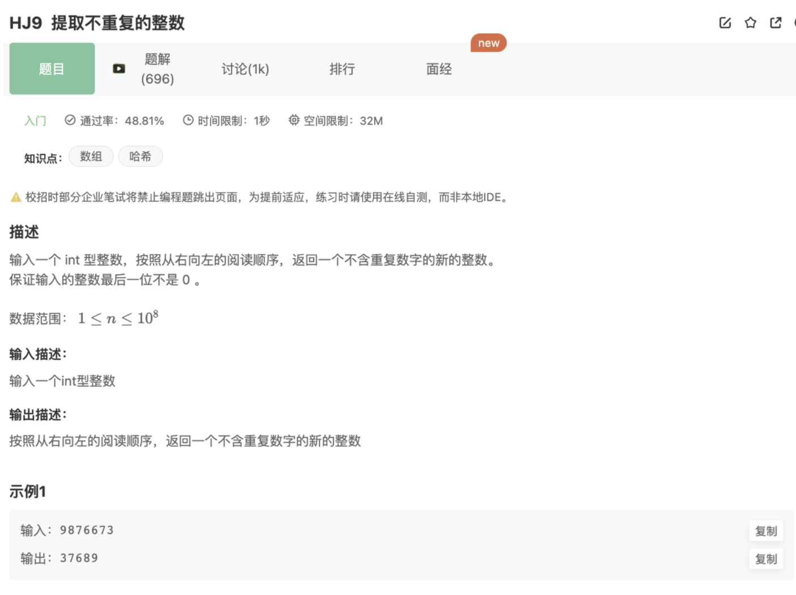

# 提取不重复的整数

## 题目



思路：

1.字符串先转数组

2.数组翻转

3.数组去重

## 代码

```jsx
const rl = require("readline").createInterface({ input: process.stdin });
var iter = rl[Symbol.asyncIterator]();
const readline = async () => (await iter.next()).value;

void async function () {
    // Write your code here
    while(line = await readline()){
        console.log(uniqueArray(line.split("").reverse()).join(""))
    }
    function uniqueArray(arr){
       return Array.from(new Set(arr))
    }
}()
```

## 补充：

1.数组去重函数

```jsx
function uniqueArray(arr){
  return Array.from(new Set(arr)) // Array.from可以接受一个iterable对象或者类数组对象
  // return [...new Set(arr)]	
}
```

2.字符串翻转函数

```jsx
 function reverseString(str){
   return str.split("").reverse().join("")
 }
```