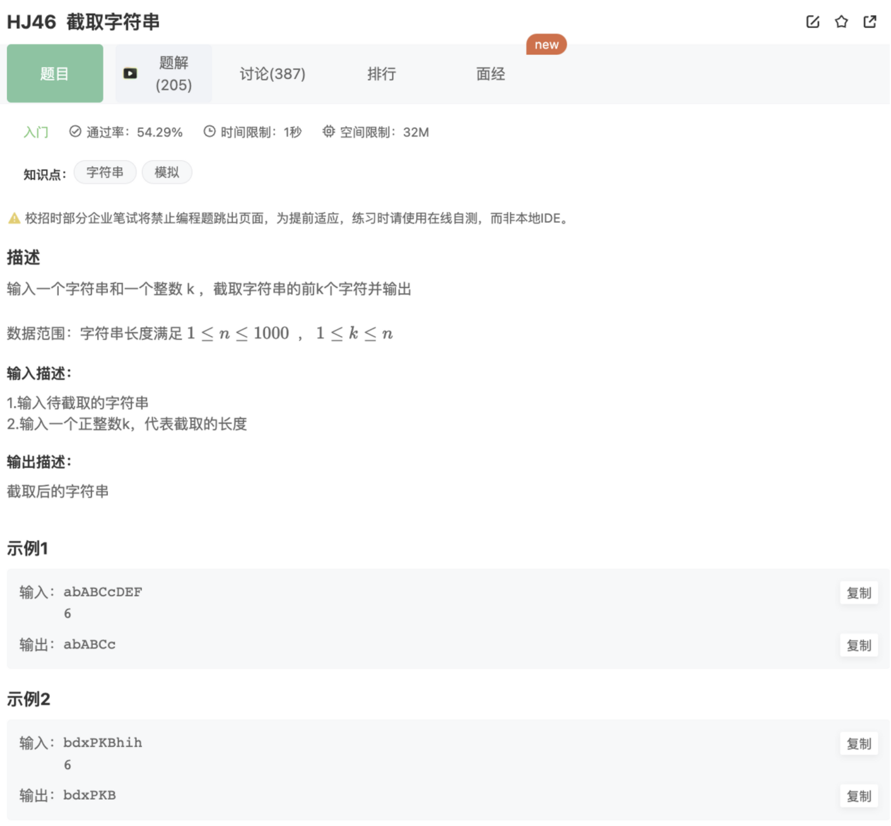

# 截取字符串

## 题目



## 代码

```jsx
const rl = require("readline").createInterface({ input: process.stdin });
var iter = rl[Symbol.asyncIterator]();
const readline = async () => (await iter.next()).value;

void async function () {
    let inputArr = [];
    while(line = await readline()){
        inputArr.push(line)
        if(inputArr.length === 2){
            let str = inputArr[0];
            let num = parseInt(inputArr[1]);
            console.log(str.slice(0,num))
        }
        
    }
}()
```

## 补充

这里用了Nodejs的一个API

```jsx
const readline = require('readline');
```

基本用法如下：

```jsx
const readline = require('readline');//在这里引入

const rl = readline.createInterface({ //创建输入输出接口
  input: process.stdin,
  output: process.stdout
});

rl.on('line',function(line){//监听控制台的输入
 var data=line.trim();//拿到控制台输入
 var result=....//编程逻辑处理

console.log(result); //输出结果
});
```

这里会有一个问题，因为输入的时候换了行，所以会有2行的输入

而编辑器默认给的就是一行一行的读取，所以在外面构建了一个inputArr数组，去拿到完整的输入后（利用length==2），再去处理