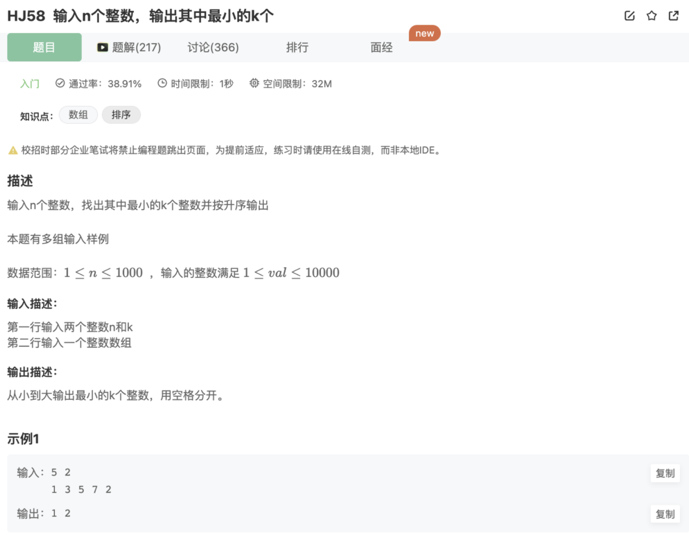

# 输入n个整数，输出其中最小的k个

## 题目



## 代码

```jsx
const rl = require("readline").createInterface({ input: process.stdin });
var iter = rl[Symbol.asyncIterator]();
const readline = async () => (await iter.next()).value;

void async function () {
    let outputArr = [];
    let outputNum = 0;
    let lineCount = 0;
    while(line = await readline()){
        lineCount++
        if(lineCount === 1){
            outputNum = line.split(' ')[1]
        }
        if(lineCount === 2){
            outputArr = line.split(' ').map( x => {
                return parseInt(x)
            }).sort((a,b)=>{
                return a - b
            }).slice(0,outputNum)
            console.log(outputArr.reduce((preValue,curValue)=>{
                return preValue + ' ' + curValue
            },'').trim())
        }
    }
}()
```

## 补充

这里用了几个ES6的API，注意一下

1.map() 2.sort() 3.reduce()