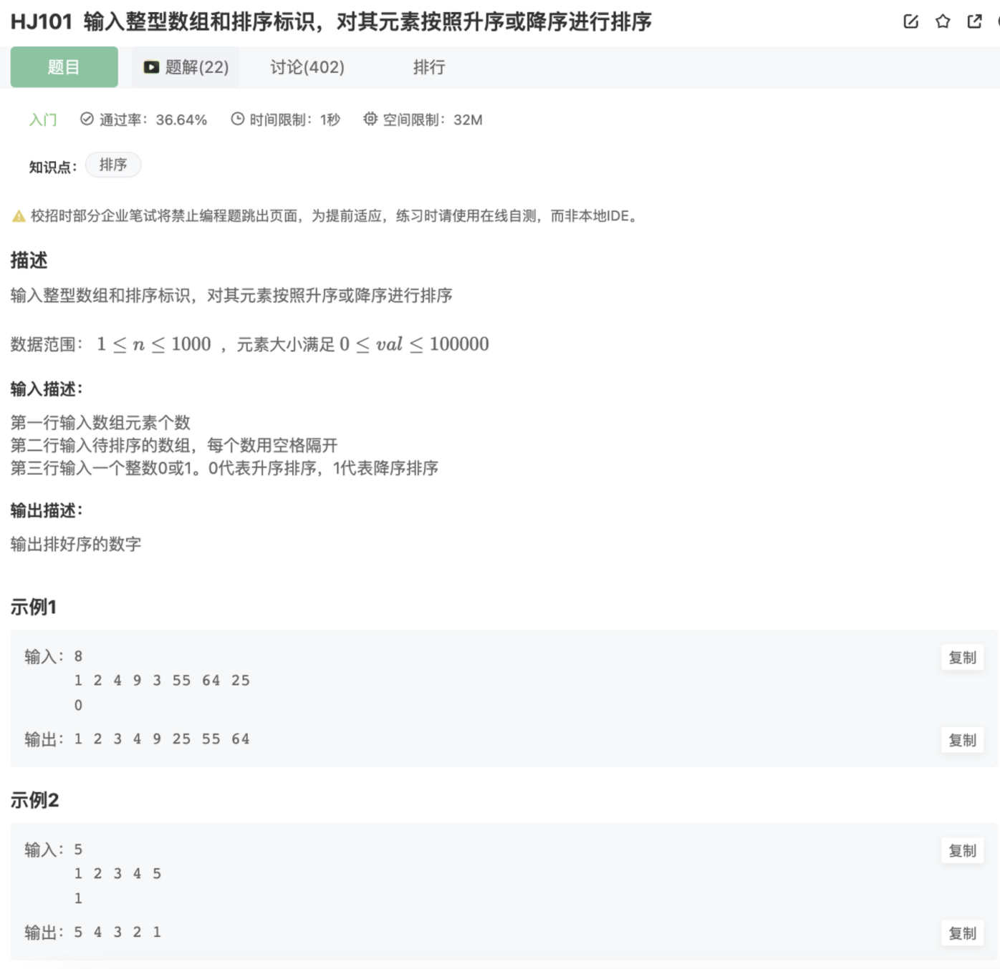

# 输入整型数组和排序标识，升序或者降序排序

## 题目




## 代码

```jsx
const rl = require("readline").createInterface({ input: process.stdin });
var iter = rl[Symbol.asyncIterator]();
const readline = async () => (await iter.next()).value;

void async function () {
    let outputArr = []
    let outputNum = 0
    let lineCount = 0
    let sortOrder = 0
    while(line = await readline()){
        lineCount++
        if(lineCount === 1){
            outputNum = parseInt(line)
        }
        if(lineCount === 2){
            outputArr = line.split(' ').map( x => {
                return parseInt(x)
            })
        }
        if(lineCount === 3){
            sortOrder = parseInt(line)
        }
    }
    outputArr = outputArr.sort((a,b)=>{
        return sortOrder === 0 ? a - b : b - a
    })
    console.log(outputArr.reduce((preValue,curValue)=>{
        return preValue + ' ' + curValue
    },'').trim())
    // console.log(outputArr)
}()
```

## 别人的答案

```jsx
const rl = require("readline").createInterface({ input: process.stdin });
var iter = rl[Symbol.asyncIterator]();
const readline = async () => (await iter.next()).value;

(async function (){
    let arrLength = await readline();
    let str = await readline(); 
    let sortType = await readline(); 
    
    let res = str.split(' ').sort((a,b)=>{
    return sortType=='0'?(a-b):(b-a);
    }).join(' ');
    console.log(res)
})()
```

## 对比

1.他3次调用`await readline()` 分别获取3行的输入，相比较我利用标识再判断的方式要更加简洁一些

2.利用了`join(’ ’)`去拼接数组元素变成字符串，相比较于我用`reduce()`去拼接也更加简洁

这里的void目的是创建一个自执行函数

```jsx
void async function () {}()
```