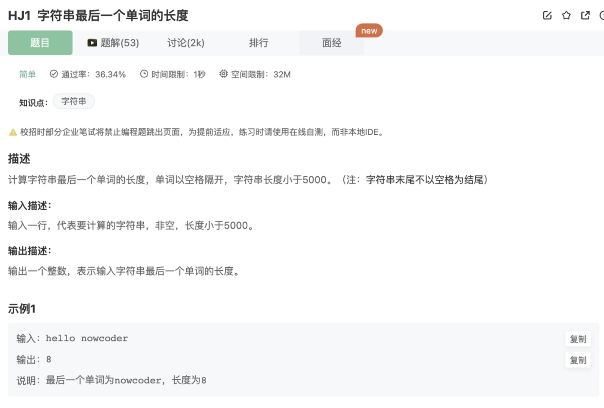

# 字符串最后一个单词的长度

## 题目



## 代码

```jsx
const rl = require("readline").createInterface({ input: process.stdin });
var iter = rl[Symbol.asyncIterator]();
const readline = async () => (await iter.next()).value;

void async function () {
    // Write your code here
    let lastLine = ''
    while(line = await readline()){
       lastLine = line
    }
    console.log(lastLine.split(' ').reverse()[0].length)
}()
```