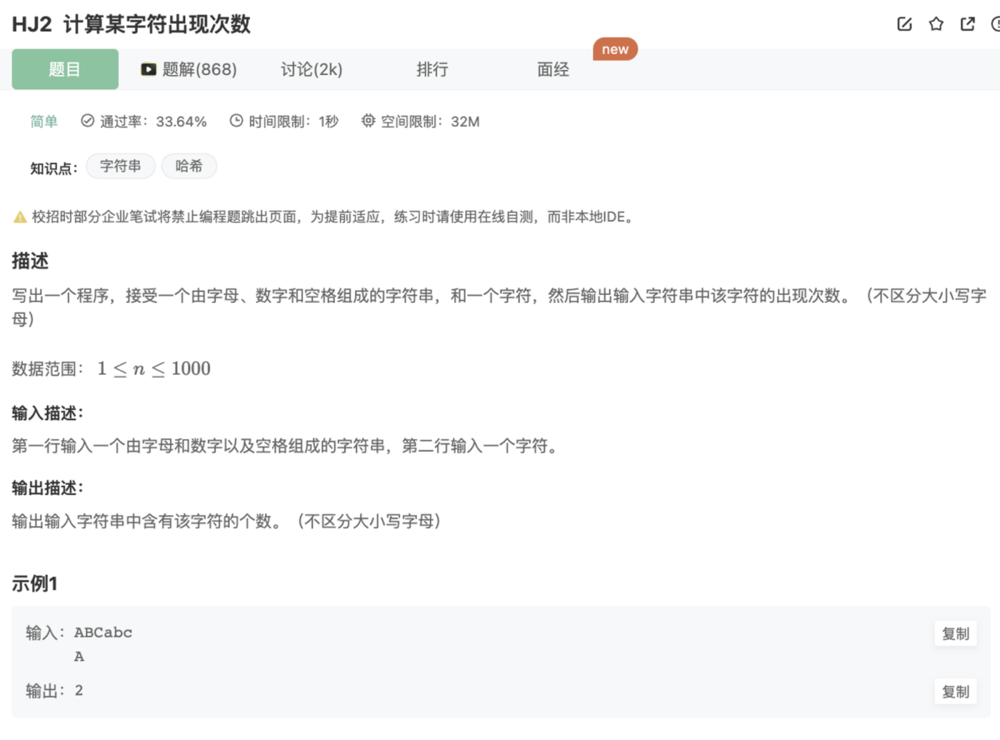

# 计算某字符出现的次数

## 题目



## 代码

```jsx
const rl = require("readline").createInterface({ input: process.stdin });
var iter = rl[Symbol.asyncIterator]();
const readline = async () => (await iter.next()).value;

void async function () {
    // Write your code here
    while(line = await readline()){
        let signChar = (await readline()).toLowerCase()
        let res = line.toLowerCase().match(new RegExp(""+signChar+"",'g'))
        if(res){
            console.log(res.length)
        }else{
            console.log(0)
        }
    }
}()
```

## 说明

1.使用了**`String.prototype.match()`**

2.在正则表达式中使用变量：字符串拼接的方式

```jsx
let signChar = (await readline()).toLowerCase()
let res = line.toLowerCase().match(new RegExp("" + signChar + "",'g'))
```