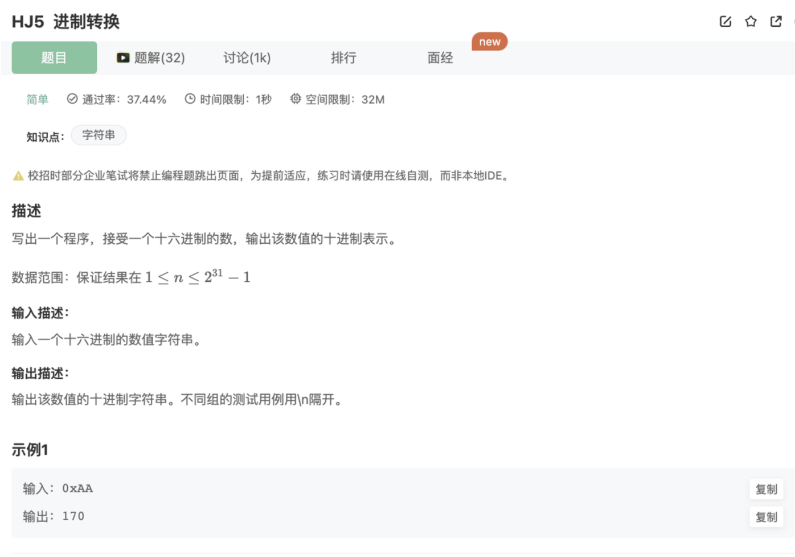

# 进制转换

## 题目



## 代码

我的

```jsx
const rl = require("readline").createInterface({ input: process.stdin });
var iter = rl[Symbol.asyncIterator]();
const readline = async () => (await iter.next()).value;

void async function () {
    while(line = await readline()){
        let res = 0
        let hash = {0:0,1:1,2:2,3:3,4:4,5:5,6:6,7:7,8:8,9:9,A:10,B:11,C:12,D:13,E:14,F:15}
        let strArrReverse = line.slice(2).split('').reverse()
        for(var i = 0;i<strArrReverse.length;i++){
            res += hash[strArrReverse[i]] * Math.pow(16,i)   
        }
        console.log(res)
    }
}()
```

别人的

```jsx
// 看你基础是否扎实，parInt能接受第二个参数，表示进制，然后输出会默认采用10进制，算是取巧的方式 
let str; while(str = readline()){ console.log(parseInt(str,16)); }
```

## 说明

`parInt()`能接受第二个参数，表示进制，然后输出会默认采用10进制